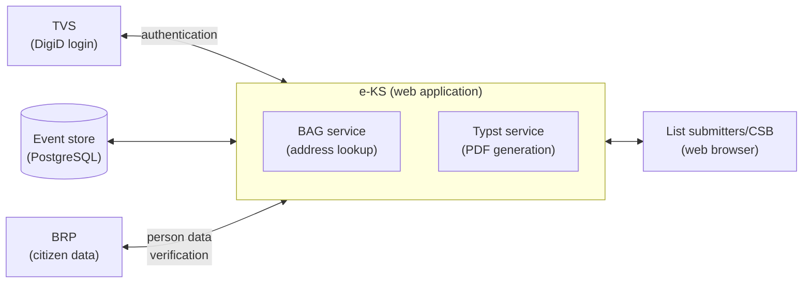

# e-KS code architecture

## Summary

e-KS is a server-side rendered Rust web application that helps a political
group assemble all the documents needed to submit a candidate list for a
specific election. The application guides the user through the nomination
procedure: it validates the data that is entered and generates the correct,
officially formatted documents (the H-models) from that data.

Each "account" is scoped to a single user, who logs in via TVS / DigiD. That
scoping lets the application persist a user's work throughout the nomination
period, so the candidate list can be built up over multiple sessions before it
is submitted.

### High-level overview


## Domain glossary

The code, the routes, and the `src/pg/<domain>/` folders all use the terms
below. Each has an established Dutch name from the Kieswet (the Dutch electoral
law); the English term is what the code uses. Article references are to
Hoofdstuk H of the Kieswet (*De inlevering van de kandidatenlijsten*) unless
noted otherwise.

| Term (code) | Dutch | Kieswet | Role in the process |
|-------------|-------|---------|---------------------|
| Political group | Politieke groepering | Art. G 1 | The political group taking part in the election. It has a registered name (the *aanduiding*), registered with the central electoral committee under Hoofdstuk G, that may be printed above its list. Modelled by `political_groups`. |
| Candidate list | Kandidatenlijst | Art. H 1 | The ordered list of candidates a political group submits for one or more electoral districts. This is the central artifact of the procedure and is filed as model **H1** (the form's model is fixed under Art. H 1, derde lid). Modelled by `candidate_lists`. |
| Candidate | Kandidaat | Art. H 6, H 9 | An electable person on a candidate list, at a specific position (ordering: Art. H 6). Each candidate provides a consent declaration, model **H9** (*instemmingsverklaring*, Art. H 9). Modelled by `candidates`. |
| Person | Persoon | n/a | A natural person record (personal data, address). A code-level abstraction, not a Kieswet term. A single person can be a candidate on multiple lists. Modelled by `persons`. |
| Electoral district | Kieskring | Art. H 2 | The geographic district a candidate list is submitted for; the list states which kieskring(en) it is filed for. A list is scoped to one or more districts. |
| List submitter | Lijstinleveraar | Art. H 3, eerste lid | The voter who hands in the candidate list to the central electoral committee in person. The notice of defects (*verzuimbrief*) is sent to this person's address. Modelled by `list_submitters`. |
| Substitute list submitter | Vervanger (voor het herstel van verzuimen) | Art. H 5 (Art. I 2) | One or more persons named on the list who, if the submitter is unavailable, may correct mistakes (*verzuimen*) on the list on the submitter's behalf (the *verzuimherstel* itself: Art. I 2). Modelled by `substitute_list_submitters`. |
| Authorised agent | Gemachtigde | Art. H 3, tweede/derde lid (Art. G 1, derde lid) | The political group's agent, registered with the central electoral committee under Hoofdstuk G, who authorises placing the political group's name above the list. This authorisation is filed as model **H3-1** (or **H3-2** for a combined name). Modelled by `authorised_agents`. |
| Representative | Gemachtigde van kandidaat | Art. H 10, H 10a | For a candidate residing outside the European part of the Netherlands: a representative, named in the candidate's consent declaration, who receives official correspondence (such as the appointment letter) on the candidate's behalf. Stored in the `persons`/`candidates` data. |
| Support declaration | Ondersteuningsverklaring | Art. H 4 | A declaration of support for a list, model **H4**, required in certain cases. |

Both an "authorised agent" and a candidate's "representative" are a *gemachtigde*
in Dutch, but they are distinct roles: the authorised agent acts for the
political group's name (H3-1, Art. H 3), the representative acts for an individual
candidate living outside the Netherlands (Art. H 10).

The **H-models** are the official forms; each is named after the Kieswet article
that requires it and whose model is fixed by ministerial regulation: H1 (Art.
H 1), H3-1 / H3-2 (Art. H 3, vijfde lid), H4 (Art. H 4, zevende lid), H9 (Art.
H 9, vierde lid).

The `finalise` domain validates the assembled data and renders the official forms
(the **H-models** H1, H3-1, H4, H9) as PDF files; `audit_log` is a read view over all
recorded changes.

### Election types

Every record of data belongs to one election, represented by the `ElectionConfig`
enum (`src/core/election/`). The user selects an election, and a
region (if applicable) at the start of a session; this choice, together with the user's stream,
forms the `(stream_id, election)` partition key. The current configurations are:

- **EK27**: the 2027 Eerste Kamer (Senate) election. National, no region.
- **PS27(province)**: the 2027 Provinciale Staten election, one configuration per
  province.
- **WS27(water council)**: the 2027 waterschap (water authority) election, one
  configuration per water authority.

`ElectionConfig` is also the ruleset: it concentrates the differences between
elections in one place rather than scattering conditionals through the code.
Each configuration carries:

- its **electoral districts**: EK27 spans a fixed national set, a PS27 province
  has one or more districts, a WS27 water authority has exactly one;
- the **significant dates**: nomination day, election day, and the date-of-birth cutoff
  for candidate eligibility;
- whether the elected body has **nineteen or more seats**: a seat-count threshold
  that, among other things, selects the EML election subcategory;
- whether **Frisian-language document export** is allowed (Friesland and
  Wetterskip Fryslân only);
- the **titles** (Dutch, Frisian, English) used in the interface and the formal
  titles printed on the H-models.

## Project structure

### Crates

e-KS is a single Rust binary (`eks`) plus two supporting library crates. They are
*not* a Cargo workspace: `validate` and `auth-service` are pulled in as
path dependencies of the root crate, each keeping its own `Cargo.lock`.

- **`eks`** (root, `Cargo.toml` + `src/`): the application itself: an Axum web
  server with Askama HTML templates and an event-sourced domain model. The
  binary entry point is `src/bin/eks.rs`; everything else lives in the library
  (`src/lib.rs`), whose module doc-comment is a good companion to this document.
- **`validate/`**: a proc-macro crate exposing the `#[derive(Validate)]` macro.
  It generates the code that turns a submitted *form* struct into a validated
  *domain* struct, driven by `#[validate(...)]` field attributes
  (`target`, `parse`, `optional`, `not_empty`, `csrf`, `flatten`, `ignore`).
  This is what the per-domain `forms/` modules build on.
- **`auth-service/`**: a small, application-agnostic crate providing the
  `/login` and `/logout` routes and an `AuthState` trait. The `eks` crate
  implements `AuthState` for its `AppState` and mounts this router; the crate
  itself knows nothing about e-KS domain types.
- **`development/`** (`eks-development`): a sibling crate that is *not* a
  dependency of `eks`. It ships local-only tooling: the `dev` orchestrator
  that brings up Docker dependencies and runs the app, the `setup` binary,
  `update_locales`, and `pdf_diff` (used by CI to to visualize PDF document
  differences).

Document generation is done using Typst via the `typst-webservice` crate,
which is a separate binary dependency (not a library crate) that runs as
an external process in production but is embedded in-process in development with
the `embed-typst` feature.

### `src/` layout

The library is split into one *domain* tree and several *infrastructure*
modules:

| Path | Responsibility |
|------|----------------|
| `src/bin/eks.rs` | Binary entry point; reads the bind address and starts the server. |
| `src/lib.rs` | Crate root: module wiring, public re-exports, architecture overview. |
| `src/router.rs` | Top-level Axum router; merges every domain's `router()` and applies middleware. |
| `src/state.rs` | `AppState`: the shared application state (config, store registry, sessions). |
| `src/filters.rs` | Askama template filters (display formatting, translation, validation errors). |
| `src/pg/` | Political group (PG) **domain** modules (see below). |
| `src/csb/` | Central voting bureau (CSB) section: import, examination, monitoring, and its own event stores. |
| `src/structs/` | Shared domain model structs (persons, political groups, candidate lists, common value types) used by both `src/pg/` and `src/csb/`. |
| `src/auth/` | Authentication: the session model and token handling, session/pending-request storage, id derivation, and the session cookie helpers + `Session` extractor. The session/store middleware and the development login endpoint live in `src/middleware/`. |
| `src/core/` | Cross-cutting infrastructure: `Config`, server startup, logging/tracing, election configuration, Askama/Typst rendering, PDF, CSV, ZIP, locales. |
| `src/store/` | The generic event store: persistence backends (memory/file/Postgres), at-rest encryption, the event hash chain, and the per-stream `StoreRegistry`. |
| `src/error/` | `AppError` and the rendering of error responses/pages. |
| `src/form/` | Generic form extraction and validation: the `Form<T>` extractor, CSRF tokens, file uploads, string validators. |
| `src/pagination/` | Reusable list-pagination helpers (params, page links, page info). |
| `src/fixtures/` | Sample data loaded into the store on startup in development/test (`fixtures` feature). |
| `src/utils/` | Small standalone helpers (id newtypes, redirects, health check, embedding helpers, etc.). |

### `src/pg/` domain modules

`src/pg/` holds the political group business logic, organised per domain.
Alongside the per-domain folders are a few section-level files that tie the
domains together:

- `store/event.rs`: `PgEvent`, the single enum of all PG domain events.
- `store/mod.rs`: `PgStoreData`, the in-memory projection built by replaying
  `PgEvent`s; `store/getters.rs` adds read accessors over it.
- `context.rs`: the request-scoped `Context` passed into templates.
- `store/extractor.rs`: extracts the per-request `PgStore` from `AppState`.

The current domains are: `audit_log`, `candidate_lists`, `candidates`,
`common`, `list_submitters`, `name_authorisations`, `persons`,
`political_groups`, `finalise`, and `substitute_list_submitters`.
(`common` is the shared domain: reusable field types (names, addresses,
dates, country codes) and shared pages/components rather than a single
entity.)

### Common structure of a domain folder

Each `src/pg/<domain>/` folder follows the same convention. A given domain
includes only the sub-folders it needs, but when present they always mean the
same thing:

| Sub-folder / file | Contains |
|-------------------|----------|
| `mod.rs` | Module doc-comment, sub-module declarations, and public re-exports. |
| `pages/` | One file per page/flow: the Axum request handlers, the `TypedPath` route definitions, and the domain's `router()` that wires them up. `pages/mod.rs` declares the typed paths and assembles the router. |
| `forms/` | Form structs, the shape of submitted HTML forms, with `#[derive(Validate)]` annotations mapping them onto domain structs. |
| `extractors/` | Custom Axum extractors (`FromRequestParts`) that load a domain entity (or related state) from the URL/store for use by handlers. |
| `structs/` | Domain model types used only by this section. Structs shared with `src/csb/` (persons, political groups, list submitters, candidates, candidate lists, common value types) live in `src/structs/<domain>/` instead and are re-exported from the domain's `mod.rs`. |
| `components/` | Askama HTML template **fragments** shared across the domain's pages (tables, form partials, step indicators). |

Page templates are co-located with their handlers: a handler in
`pages/update.rs` renders `pages/update.html`. Askama is configured
(`askama.toml`) to resolve templates relative to `src`, so templates can
reference fragments from any domain. This is most used for the application-wide shared layout and macro fragments in `src/pg/common/components/`.

A few domains also carry domain-specific helper files next to these folders,
for example `candidate_lists/importer.rs` (CSV/EML import) and
`political_groups/steps.rs` (multi-step flow state).


## Request lifecycle

A request passes through a fixed chain of middleware before it reaches a
handler. The router (`src/router.rs`) installs the layers; their effective
order on an incoming request is:

1. **`eks-key` gate.** If `EKS_KEY` is configured, the request must carry a
   matching `x-eks-key` header, otherwise it is rejected with `401`. When the
   key is unset this layer is a no-op. Intended for gating the app behind a
   known upstream.
2. **Tracing and security headers.** HTTP tracing is opened, and the security
   response headers (CSP, `X-Frame-Options`, etc.) are scheduled.
3. **`session_middleware`.** Reads the `EKS_SESSION_ID` cookie and looks the
   session up in the `SessionStore`. A missing or invalid session redirects to
   `/login`. Otherwise the session's `last_activity` is refreshed and the
   `Session` is placed in the request extensions.
4. **`store_middleware`.** Takes the `(stream_id, current_election)` from the
   session and resolves the matching `PgStore` from the registry. A session
   that has not yet picked an election is redirected to `/select-election`. The
   middleware then calls `store.load()` so the projection catches up with any
   events this process has not seen, and places the `PgStore` in the request
   extensions.
5. **The handler.** Its arguments are extractors: the typed path, `Context`,
   `Session`, `PgStore`, the domain extractors (which load an entity from the
   store), `Form<T>` (parse and validate the body), and `State<...>`.

The handler itself follows one of two shapes:

- **Read (GET).** It reads from the `PgStore` projection, fills an Askama
  template struct, and returns `HtmlTemplate(template, context)`.
- **Write (POST).** It validates the submitted `Form<T>`. On a validation error
  it re-renders the same page with the field errors. On success it constructs
  an `PgEvent` and calls `store.update(event)`, which persists and applies the
  event, then returns a redirect (the Post/Redirect/Get pattern). This covers
  deletions too: removals are submitted as HTML form POSTs rather than DELETE
  requests, since browsers can only emit GET and POST from a `<form>`.

An `AppError` returned from anywhere in this chain is caught by the
`render_error_pages` layer, which turns it into the appropriate HTML error page
and status code. On the way out, the session and store middleware may attach a
`Set-Cookie` header, the security headers are written, and the trace is closed.

## Key dependencies

e-KS deliberately keeps a small dependency tree (every crate is reviewed, and
`cargo deny` enforces the license/advisory policy in `deny.toml`). Five
dependencies shape the architecture enough to be worth describing on their own.

### [`axum`](https://crates.io/crates/axum): HTTP framework

The application *is* an Axum `Router`. The wiring follows a consistent pattern:

- **Per-domain routers.** Each `src/pg/<domain>/` exposes a `router()` that
  returns a `Router<AppState>`; `src/router.rs::create` merges them all and adds
  the cross-cutting layers. Feature-gated routers (development login, the embedded
  BAG endpoints, live-reload, `memory-serve` static assets) are merged in the
  same place.
- **Typed routing** (via [`axum-extra`](https://crates.io/crates/axum-extra)). Routes are declared as
  `#[derive(TypedPath, Deserialize)]` structs with a `#[typed_path("...")]`
  attribute and `rejection(AppError)`. Handlers take the typed-path struct as
  their first argument, so URLs are checked at compile time and can be built in
  reverse, the `<endpoint>_path()` helper methods on domain structs (e.g. on
  `Candidate`) produce links for templates without hand-written URL strings.
- **Extractors.** Handlers declare what they need as arguments: the
  request-scoped `Context`, the `PgStore`, the `Session`, the `Form<T>`
  validating extractor, `State<TypstRenderer>`, and the custom per-domain
  extractors in each `extractors/` folder (which implement `FromRequestParts`
  to load a domain entity from the URL + store).
- **Middleware and layers.** Session handling, store resolution, error-page
  rendering, and the `eks-key` check are installed with
  `middleware::from_fn_with_state`. [`tower-http`](https://crates.io/crates/tower-http) adds the security response
  headers (CSP, `X-Frame-Options`, `X-Content-Type-Options`, `Referrer-Policy`)
  and HTTP tracing.
- **Shared state.** `AppState` derives `FromRef`, so sub-states such as
  `TypstRenderer` can be extracted directly into handlers without having to thread through the whole `AppState`.

### [`askama`](https://crates.io/crates/askama): compile-time HTML templates

All HTML is rendered with Askama, type-checked against its template structs at
compile time. `askama.toml` roots template resolution at `src/pg`, and
templates are co-located with their handlers (for example, `pages/update.rs` lives right next to
`pages/update.html`); shared fragments live in each domain's `components/`,
with the global layout and macros in `src/pg/common/components/`.

- A handler builds a `#[derive(Template)]` struct (`#[template(path = "...")]`)
  and returns it wrapped in `HtmlTemplate(template, context)`
  (`src/core/templates.rs`). `HtmlTemplate` implements `IntoResponse`: it
  renders the template and sets `Cache-Control: no-store`. Every HTML page is
  session-bound and carries personal candidate data, so it must not be cached
  anywhere on the path back to the user — most importantly not by any upstream
  CDN or proxy that may sit in front of the application, where any retention
  of HTML would be a privacy issue.
- The second field is the request-scoped `Context`, which implements
  `askama::Values`. This is how templates reach request state (locale, session,
  query-string flags) that is not part of the template struct itself.
- Custom **filters** are defined in `src/filters.rs` with
  `#[askama::filter_fn]`. They cover i18n (`trans`), formatting (`display`,
  `datetime`, `flag`), validation-error display (`error`), and `*_value`
  accessors that read request-scoped data out of `askama::Values`.

### [`memory-serve`](https://crates.io/crates/memory-serve): embedded static assets

The frontend (TypeScript + CSS) is bundled by esbuild into `frontend/static`.
In production those assets are compiled *into* the binary so there is no
separate asset directory to deploy:

- Gated behind the `memory-serve` cargo feature. `build.rs` calls
  `memory_serve::load_directory`, and `router.rs` uses the `memory_serve::load!()`
  macro to mount the assets under `/static`, with cache-busting filename
  aliases (`/{hash}-index.js`, `/{hash}-index.css`).
- When the feature is **off** (development), `/static` instead proxies to the
  esbuild dev server on `localhost:8888`, which also gives hot-reloading of CSS
  and JS. The URL paths are identical in both modes, so templates never need to
  know which mode is active.

### [`typst-webservice`](https://github.com/tweedegolf/typst-webservice): PDF generation

The official candidate-nomination forms (models H1, H3-1, H4, H9, etc.) are produced
as PDF files from Typst templates. The `submit` domain assembles serializable
`typst_*` input structs (`src/pg/finalise/structs/`) and hands them to a
`TypstRenderer` (`src/core/typst_renderer.rs`), which has two modes selected by
the `embed-typst` feature:

- **`Embedded`**: runs typst-webservice in-process from a `PdfContext` built
  out of Typst assets baked into the binary at build time (`build.rs` via
  `tooling/typst`, loaded by `src/utils/embed_typst.rs`). Rendering is CPU-bound,
  and runs on `spawn_blocking`.
- **`Http`**: POSTs the input JSON to an external typst-webservice over HTTP
  at `TYPST_URL`.

The renderer is built once at startup (`build_typst_renderer` in `state.rs`),
stored in `AppState`, and reached by handlers via `State<TypstRenderer>`.
`finalise/pages/documents.rs` renders multiple documents and streams them to the
client as a single ZIP download.

### [`bag_address_lookup`](https://github.com/tweedegolf/bag-address-lookup): Dutch address lookup

Address fields are validated and autocompleted against the BAG
(*Basisregistratie Adressen en Gebouwen*): postal code + house number resolve
to a street and locality, and locality names autocomplete. This backs the
frontend's `/lookup` and `/suggest` endpoints.

## Configuration and feature flags

### Runtime configuration

Runtime configuration is read from environment variables once at startup into a
`Config` struct (`src/core/config.rs`), which is then `Box::leak`-ed to a
`&'static Config` and shared through `AppState`. The variables:

| Variable | Purpose |
|----------|---------|
| `STORAGE_URL` | Persistence backend: `memory://`, `local://<dir>`, or `postgres://<connection_string>`. |
| `TYPST_URL` | External typst-webservice URL (only without the `embed-typst` feature). |
| `ID_DERIVATION_KEY` | Master secret for stream-id derivation. |
| `ENCRYPTION_DERIVATION_KEY` | Master secret for event-payload encryption. |
| `TLS_CERT_PATH` / `TLS_KEY_PATH` | HTTPS certificate and key; both or neither. |
| `SERVER_NAME` | Short server identifier shown in the page footer. |
| `EKS_KEY` | Optional shared secret for the `x-eks-key` request gate. |
| `BIND_ADDRESS` | Address the server binds to (also accepted as a CLI argument). |

The binary itself only reads `env::var`, but the deployment can supply these
variables from a file (e.g. systemd `EnvironmentFile=`, Docker `--env-file`,
Kubernetes secret mounts). This is the preferred way to provide the master
secrets (`ID_DERIVATION_KEY`, `ENCRYPTION_DERIVATION_KEY`, `EKS_KEY`) so they
never end up in shell history or process listings.

In `dev-features` builds a missing variable falls back to a built-in development
default; in a production build a missing required variable is a startup error
(`AppError::MissingEnvVar`).

### Cargo features

The build is tailored through Cargo features (`Cargo.toml`). The `default` set
is development-oriented; a production build typically disables `dev-features`
and enables the embedding and TLS features.

| Feature | Effect |
|---------|--------|
| `dev-features` | Relaxes config (dev defaults), enables the dev login and the bag-service proxy. |
| `database` | Postgres / SQLx storage backend. |
| `migrations` | Run database migrations on startup. |
| `fixtures` | Optionally load sample data into the store when an election is selected. |
| `verify-event-hash-chain` | Recompute and verify the event hash chain when replaying. |
| `livereload` | Live-reload assets and templates during development. |
| `memory-serve` | Serve the frontend assets embedded in the binary. |
| `embed-typst` | Run the Typst PDF service in-process instead of over HTTP. |
| `tls` | Serve over HTTPS via rustls. |
| `db-tests` / `net-tests` | Enable database- and network-dependent tests. |

## Event storage and the event hash chain

### Event sourcing

e-KS uses **event sourcing**: rather than storing the current state of each
record and overwriting it on every change, the application stores every change
as an immutable event in an append-only log. The current state, the
`PgStoreData` projection, is never persisted directly; it is *derived* by
replaying that log of `PgEvent`s from the beginning.

This fits the application well for a few reasons:

- **Auditability.** The candidate-nomination procedure must be fair,
  transparent, and verifiable. An append-only event log *is* the audit trail:
  every change to a candidate list, person, or submitter is recorded with who
  made it and when, and nothing is ever silently overwritten. The `audit_log`
  domain is simply a read view over this same stream.
- **Bounded, short-lived data.** The data set is small and tied to a single
  election: it covers one nomination procedure and is cleared once that
  election is over. There is no long-lived, ever-growing dataset to replay, so
  the usual cost of event sourcing, replaying a long history to rebuild state,
  stays negligible here. The standard mitigation, periodic snapshots of the
  projection, is therefore not needed and is left out of the design.
- **Time travel.** Because state is a pure function of the event prefix,
  the exact state at any earlier point can be reproduced by replaying the log
  up to a chosen event. This makes it possible to reconstruct precisely what
  the system showed at a given moment, invaluable when a decision or dispute
  needs to be reviewed after the fact.

The remainder of this section describes how that event log is stored and how
its integrity is protected.

### The store at runtime

Event sourcing is implemented by a handful of generic types in `src/store/`,
parameterized over a projection type `D`:

- **`StoreData`** is the trait a projection implements: how to `apply` an event,
  and what its last event id and chain hash are. `PgStoreData` is the one
  concrete implementation.
- **`Store<D>`** is a handle scoped to a single `(stream_id, election)` pair. It
  owns the persistence backend, the per-stream encryption cipher, and the
  in-memory projection as an `Arc<RwLock<D>>`. Cloning a `Store` is cheap: the
  clone shares the same projection and persistence. `PgStore` is the alias
  `Store<PgStoreData>`.
- **`StoreRegistry<D>`** lives in `AppState` and caches one `Store` per
  `(stream_id, election)` in a map behind a `RwLock`. `get_or_create` returns
  the cached store, or builds one: it constructs the `Store`, calls `load()` to
  replay the persisted events into a fresh projection, runs an optional
  one-time init hook (this is where `fixtures` are loaded on first use), and
  caches the result.

Two operations drive a `Store`:

- **`load()`** replays persisted events into the projection. It applies only
  events whose id is higher than the projection's current `last_event_id`, so a
  long-lived cached store catches up incrementally. `store_middleware` calls it
  on every request, which keeps multiple application instances sharing one
  database convergent.
- **`update(event)`** persists a new event (encrypt and append, or in-memory)
  and applies it to the projection. The apply step is guarded: if a concurrent
  writer already advanced the projection past this event's id, the duplicate
  apply is skipped.

The projection sits behind a `parking_lot::RwLock`: reads take a read lock,
event application takes a write lock.

### Storage backend

All domain changes are stored as an append-only stream of events, partitioned per
`(stream_id, election)`. Three backends exist (selected via `STORAGE_URL`):
in-memory (`memory://`), local files (`local://`), and PostgreSQL (`postgres://`).
On the file and database backends each event payload is encrypted at rest; the
in-memory backend keeps plaintext only.

### Stream IDs and not leaking the BSN

Each user's events live in their own stream, identified by a `StreamId`. That
ID is **derived deterministically from the user's BSN** (the Dutch citizen
service number) rather than being a stored or random value, see
`IdDeriver` in `src/auth/derive_id.rs`.

Derivation runs HKDF-SHA256, keyed with a master secret (`ID_DERIVATION_KEY`),
over the BSN, and packs the 16-byte output into a UUIDv8 `StreamId`. Two
properties matter here:

- **Deterministic.** The same BSN always maps to the same `StreamId`, so a
  returning user is reconnected to their existing stream, without the BSN ever
  being written to disk. The BSN is held only transiently in memory (wrapped in
  `SecretString`) while the ID is derived.
- **One-way and unguessable.** Because the derivation is an HKDF keyed with the
  master secret, a `StreamId` cannot be reversed back to a BSN, and an attacker
  cannot enumerate streams without also holding the secret.
  The persisted data is therefore keyed only by an opaque UUID; no
  private identification number appears in the database or in file names.

A domain-separation salt (`"e-KS BSN identifier derivation v1"`) and an
`info` prefix scope this derivation so its output can never collide with the
encryption-key derivation below. One `StreamId` covers all of a user's
elections; the `election` is a separate axis of the `(stream_id, election)`
key.

### Event payload encryption and key derivation

On the file and PostgreSQL backends, every event payload is encrypted at rest
with AES-256-GCM. For implementation details, see `EventEncryption` / `EventCipher` in
`src/store/encryption.rs`.

The encryption key is **per `(stream_id, election)`**. It is derived with
HKDF-SHA256 from a master secret (`ENCRYPTION_DERIVATION_KEY`, distinct from the
ID-derivation secret), mixing the `stream_id` and the election's stable ID into
the `info` string. The master secret is HKDF-extracted once at startup; each
per-stream key is only the cheaper HKDF-Expand step. The consequences:

- Every `(user, election)` pair gets its own independent key, so a key
  recovered or misused for one stream reveals nothing about any other, and
  payloads cannot be transplanted between streams or elections.
- A payload is `postcard`-serialized, then AES-256-GCM encrypted under a fresh
  random 12-byte nonce, and stored as `nonce ‖ ciphertext ‖ tag`. The GCM
  *associated data* additionally binds each ciphertext to its event metadata and
  chain position (see the hash chain below).
- A database dump or a copy of the files, on its own, is unreadable: every
  payload is indistinguishable from random without the master secret.

**This is a defence-in-depth measure, not the primary protection.** The server
necessarily holds the master secrets in memory and works with plaintext, so the
main line of defence remains keeping the database and the application server
themselves protected from unauthorised access, and storing the data on an
encrypted, access-controlled volume. At-rest encryption only narrows the blast
radius of one specific failure: read access to the database or files *without*
access to the server's memory or its master secrets.

### The event hash chain

Every persisted event also carries a 32-byte `hash` that links it to the previous
event, forming a tamper-evident hash chain over the stream:

```
hash_n = SHA256( hash_{n-1} ‖ event_id_n (u64 LE) ‖ created_at_n (i64 LE, microseconds) ‖ body_n )
```

- `hash_0` (the predecessor of the first event) is the all-zero "genesis" hash
  (`GENESIS_HASH`).
- `body_n` is the *persisted* representation of the payload: the
  `nonce ‖ ciphertext ‖ tag` AES-GCM blob for the file/database backends, or the
  postcard encoding of the plaintext for the in-memory backend. Hashing the
  *encrypted* blob (which is indistinguishable from random and carries a fresh
  nonce) is deliberate: it lets the hash be stored **unencrypted** without leaking
  anything about the plaintext, while still committing to the exact stored bytes.
- `created_at` is hashed at microsecond precision because that is the precision that remains after a round-trip through the on-disk frame format and Postgres `timestamptz`.

In addition, the AES-GCM *associated data* for each event is
`event_id ‖ created_at ‖ hash_{n-1}`. This authenticates the cleartext metadata
stored next to the ciphertext and pins each ciphertext to its position in the
chain: a modified payload or `event_id`/`created_at`, a reordered event, or a
removed middle event all make decryption fail on replay with
`AppError::EventDecodeError`, even without an explicit chain check. The database
backend also tracks the highest `event_id` in a `streams` row, so dropping the
*last* event is detected too.

The explicit chain check on replay (recomputing each event's stored `hash` from
the previous hash and the stored body) is gated behind the
`verify-event-hash-chain` cargo feature, off by default: it adds a SHA-256 over
every event loaded. Its only unique contribution over the AES-GCM binding above is
detecting an in-place rewrite of the stored `hash` value itself; enable it where
that extra check is worth the load-time cost.

On the database backend the `events.hash` column has an index (`events_hash_idx`)
to support looking up an event by its chain hash.

The chain is not a substitute for storing the database/files on an encrypted,
access-controlled volume; it is a defence-in-depth, integrity-detection measure.
